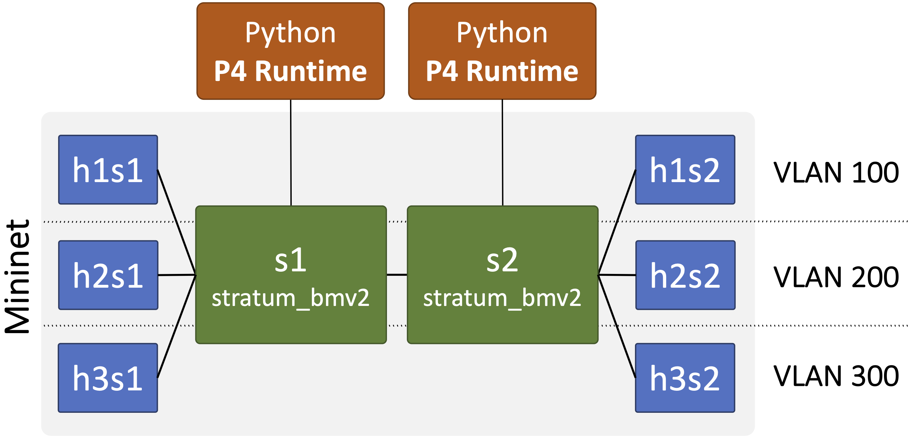

# Assignment 2: From Bridging to Switching with VLANs 

In [assignment1](../assignment1), you learnt how to implement and use the Socket API for sharing files and messages between two hosts. Now, you will move out of these hosts and go deeper into the actual network, where you will learn how the various network devices (bridges and switches) forward these messages (and packets) between hosts. The assignment will give you a deep dive into the internal workings of these devices to help understand how they (1) learn and become aware of the different hosts on the network and (2) forward packets to minimize the unwanted traffic floating in the network. 

This part of the assignment will give you experience with basic layer-2 switching. You will be implementing your own custom switch that will intercept ARP packets to learn the existence of hosts in the network as well as which ports they reside on (i.e., the learning part of the switch), and then directly foward any future packets based on this information (i.e., the forwarding part of the switch). You will also add support for VLAN in your switch to make sure that hosts belonging to a particular VLAN are isolated from each other (i.e., never see packets from hosts of the other VLANs, even the ARP packets).

You will build and run your switch on an emulated Mininet network using P4 programmable switches and the P4 Runtime API.

## Getting Started

### Part A: Virtual environment and network topology

This assignment builds on [assignment0](../assignment0), so please ensure that you have a successfully working virtual environment. You will be building a slightly different network this time, as depicted in the following figure.

<br>

- The example network consists of two switches (`s1` and `s2`) with six hosts (`h1s1`, `h2s1`, `h3s1`, `h1s2`, `h2s2`, and `h3s2`). You may consider it as a network with two segments: `h1s1`, `h2s1`, and `h3s1` forming one segment with `s1`, and `h1s2`, `h2s2`, and `h3s2` forming the other one with `s2`. Moreover, when VLAN is enabled, `h1s1` and `h1s2` form one virtual LAN (`100`), `h2s1` and `h2s2` form a second virtual LAN (`200`), and `h3s1` and `h3s2` form a third virtual LAN (`300`). **Note: your assignment will be graded against different topolgoies and not just the one shown here!**

- Instead of ONOS, we will be using the [P4 Runtime API](https://p4.org/p4-spec/p4runtime/main/P4Runtime-Spec.html) to write a custom Python-based packet-processing logic for each switch. Arriving packets will be sent to the python P4 runtime, which will implement the necessary logic (bridging or switching) to decide the future of these packets (e.g., drop or forward or broadcast). 
  > **INFO:** The P4 Runtime API is the same southbound API used by the ONOS controller when interacting with the P4 programmable switches (see more [here](https://www.youtube.com/watch?v=BE_y-Sz0WnQ)).

- We have also updated [`Makefile`](Makefile) to make it easier to run and test your assignment. You can type `make help` from the top directory to list an example usage of the necessary commands.

### Part B: A walkthrough of a learning bridge

Before imlpementing a learning switch (with VLAN), let's take a walkthrough of the provided codebase using learning bridge as an exmaple. 

Recall that a simple bridge broadcasts each incoming packet to all ports, except the ingress port. A learning bridge optimizes on this simple bridge by dropping all packets that belong to the same segment. For example, in the topology earlier, if `h1s1` is communicating with `h2s1`, the switch `s2` will drop any such packets arrivng on its port connected to `s1`. It will do so, by maintaining a table that maps the source Ethernet address to the ingress port for each packet it sees. Then, for later packets, the switch looks up the table using their desitnation Ethernet address: if the port found is same as ingress port of the incoming packets, indicating that the desitnation resides on the same port the packets came in from, the switch drops such packets; otherwise, it broadcasts them as usual.

#### The learning bridge code

The [`bridge.py`](assignments/assignment2/p4rt-src/bridge.py) script under the `assignments/assignment2/p4rt-src` folder implements the logic of a learning bridge. Please invest sometime going through the code to understand its various components in detail. You will be working with similar functions when implementing your custom learning switch.

The most important function to look at is [`ProcPacketIn()`](assignments/assignment2/p4rt-src/bridge.py#L71) that receives and processes all packets entering the switch. There are two main stages of this fucntion:
- **Packet parsing stage ([line 87](assignments/assignment2/p4rt-src/bridge.py#L87)).** <br>The bridge parses the ingress port, as metadata, and the Ethernet header of each incoming packet, and forwards it to the learing stage.
- **Learning bridge stage ([line 126](assignments/assignment2/p4rt-src/bridge.py#L126)).** <br>The bridge maintains a table (`eth_to_port_map`) that maps the source Ethernet address to its ingress port. 
  - First, the bridge checks if the destination Ethernet address of the packet matches an entry in this table. 
  - If there is a match, the bridge then compares the ingress port of the incoming packet with that of the matching entry. 
    - If it's a match, it drops the packet---the source and desination hosts are on the same port of the switch (i.e., segment). 
    - Otherwise, it broadcasts the packet to all ports except the ingress port.
  - If there is no match, the bridge hasn't learned anything about the current packet yet, and broadcasts it as usual.
  - Finally, the bridge updates its `eth_to_port_map` table with the source Ethernet address and ingress port of the current packet.

To see all this in action, please give it a try yourself!

<details><summary><b>Try it yourself! (Click Me)</b></summary>
<br>

- **Start the Mininet environment**. On a new terminal, run:
  ```bash
  $ cd assignments/assignment2
  $ make mininet topo=linear,2,3
  ```

  > **INFO:** The argument `topo=linear,2,3` tells Mininet to start the virtual environment with our example topology, above (i.e., two switches connected linearly with each having three hosts). You can verify this by running the `nodes` command from within the Mininet shell.
  > 
  > ```bash
  > mininet> nodes
  > available nodes are:
  > h1s1 h1s2 h2s1 h2s2 h3s1 h3s2 s1 s2
  > ```

  Notice, that Mininet now runs two switches each listening on their respective GRPC port for python P4 runtime to connect to.
  ``` bash
  *** Starting 2 switches
  s1 ⚡️ stratum_bmv2 @ 50001
  s2 ⚡️ stratum_bmv2 @ 50002
  ```

- **Start learning bridge (python P4 runtime) for each switch**.
  - Open a new terminal and connect to `s1` on port 50001
    ```bash
    $ make controller name=bridge grpc_port=50001 topo=linear,2,3
    ```
  - Open another terminal and connect to `s2` on port 50002 
    ```bash
    $ make controller name=bridge grpc_port=50002 topo=linear,2,3
    ```

  > **INFO**: The argument `name=bridge` specifies whether you are running a bridge or a switch, `grpc_port=50001` tells which grpc port to connect to, and `topo=linear,2,3` indicates the topology being used.

  Once running, you should see INFO messages started to print on the terminal. For example, here's a sample output for `s1`:
  ```bash
  Bridge Started @ Port: 50001
  Press CTRL+C to stop ...
  INFO: Log committed to logs/bridge-50001-table.json
  INFO: Log committed to logs/bridge-50001-table.json
  ```

  > **INFO:** 
  > - You can view current entries in the learning bridge table using, e.g., `make controller-logs name=bridge grpc_port=50001`.
  > - You can terminate the controller by pressing CTRL+C at any time.

- **Start `tcpdump` on `h2s1`, `h1s2`, and `h2s2`**.
  - In a new terminal, log into `h2s1` using `make host name=h2s1` and run:
    ```bash
    root# tcpdump -i h2s1-eth0 -l
    ```
  - Repeat the same step for the remaining two hosts `h1s2` and `h2s2`.

- **Let's ping `h2s2` from `h1s1` sitting across the two switches**.
  - In a new terminal, log into `h1s1` using `make host name=h1s1` and run:
    ```bash
    root# ping 10.0.0.4
    PING 10.0.0.4 (10.0.0.4) 56(84) bytes of data.
    64 bytes from 10.0.0.4: icmp_seq=1 ttl=64 time=11.3 ms
    64 bytes from 10.0.0.4: icmp_seq=2 ttl=64 time=5.43 ms
    ```
    > **INFO:** You can find the IP address of the host using the `ip address` or `hostname -I` commands. For example, from inside `h2s2`, run:
    > ```bash
    > # hostname -I
    > 10.0.0.4
    > ```
  - From the `tcpdump` output for `h2s1`, `h1s2`, and `h2s2`, you will see that all these hosts are receiving the ICMP echo request/reply packets, which is the right behavior as hosts (`h1s1` and `h2s2`) are sitting across switches in two different segments. Here's a sample output with all terminals displayed together.<br><br>
  <br>

- **Let's ping `h2s1` from `h1s1` sitting on the same switch**.
  - From `h1s1` terminal run:
    ```bash
    root# ping 10.0.0.3
    PING 10.0.0.3 (10.0.0.3) 56(84) bytes of data.
    64 bytes from 10.0.0.3: icmp_seq=1 ttl=64 time=3.88 ms
    64 bytes from 10.0.0.3: icmp_seq=2 ttl=64 time=3.95 ms
    ```
  - This time, from the `tcpdump` output for `h2s1`, `h1s2`, and `h2s2`, you will see that only `h2s1` is receiving the ICMP echo request/reply packets. The learning bridge is succesfully filtering packets destined to hosts in the same segment. Here's a sample output with all terminals displayed together.<br><br>
  <br>
</details>

### Part C: Building a learning switch with VLAN

Now, let's jump into the most interesting part of the assignment, which is to build your own custom layer-2 learning switch with VLAN support. 

Again, recall that a learning switch is another optimization on top of a learning bridge. Instead of filtering packets belonging to the same segments, a layer-2 switch learns and maintains information about the ports to which the different hosts are connected to. And, whenever a packet comes in for a particular host, rather that blindly broadcasting packets, the switch instead looks up the stored information and forwards the packet directly on a port leading to the desintation host. The switch gradually learns about the existence of various hosts connected on the network by intercepting ARP packets and maintaining a table that maps source Ethernet addresses to ingress ports.

> **INFO:** The table in a learning switch seems quite similar to that of a learning bridge; however, it's role is quite different. Rather than filtering packets belonging to the same segments in a bridge, it's used to find out the exact target port of the desintation host in the learning switch.

Virtual LAN (or VLAN) is a feature that extends a learning switch to configure two or more completely separate networks on top of a single switch or network of switches. For example, in our exmaple topology above, `h1s1`/`h1s2`, `h2s1`/`h2s2`, and `h3s1`/`h3s2` form three completely separate networks. With VLAN, these three networks can now be implemented using the same switches `s1` and `s2`, rather than having three different physical peer-to-peer links.

#### The learning switch (with VLAN) code

The [`switch.py`](assignments/assignment2/p4rt-src/switch.py) script under the `assignments/assignment2/p4rt-src` folder provides the scaffoling code for a learning switch. Please make sure to read and understand the code carefully before starting to program. You should program only in the locations of the provided script marked with `TODO` comments. There are four `TODO` sections in the script: (1) for the two stages, packet parsing and learning/VLAN, in the [`ProcPacketIn()`](assignments/assignment2/p4rt-src/switch.py#L77) function and (2) for adding/deleting VLAN-specific broadcast rules in the `__main__` portion of the script (read below). You can add functions if you wish, but do not change script or any other file name, as they will be used for automated testing.

As in the case of the learning bridge, the most important function in a learning switch is also `ProcPacketIn()` that receives and processes all packets entering the switch. The two main stages are:
- **Packet parsing stage ([line 93](assignments/assignment2/p4rt-src/switch.py#L93)).** <br>You need to add code to complete the packet parser. It should read the following information from each incoming packet:
  - Parse the ingress port as metadata.
  - Parse the Ethernet header (source/destination MAC addresses and type).
  - Parse the VLAN header (if present). 
  > **INFO:** You can read more about the Ethernet packet format [here](https://wiki.wireshark.org/Ethernet), and VLAN [here](https://wiki.wireshark.org/VLAN).
- **Learning switch/VLAN stage ([line 130](assignments/assignment2/p4rt-src/switch.py#L130)).** <br>You need to add code to complete the learning switch logic with VLAN support. The switch must carryout the following tasks for each incoming packet:
  - If the packet is an ARP request,
    - learn the Ethernet address to port mapping by updating the `eth_to_port_map` table with the new source MAC and ingress port pair.
    - broadcast the ARP packet;
      - however, make sure if it's a VLAN packet then only those hosts belonging to the particular VLAN receive the packet (use `vlan_id_to_ports_map` table for this).
  - Else, for any other packet,
    - forward it using the learned Ethernet address to port mapping (i.e., `eth_to_port_map` table).
    - if no mapping exists, drop the packet (we haven't received an ARP request for it yet).

You also need to add code to **install VLAN-specific broadcast rules (lines [242](assignments/assignment2/p4rt-src/switch.py#L242) and [273](assignments/assignment2/p4rt-src/switch.py#L273))**. The default broadcast rule copies and forwards packet to all ports of the switch except the ingress port. Whereas, in the case of VLAN, you need to broadcast packets only to those ports belonging to a given VLAN. 

> **INFO:** The reference solution has roughly **62** (well commented and spaced) lines of code in the four `TODO` sections of the `switch.py` script.

Once you have completed the script, give it a try!

<details><summary><b>Try it yourself! (Click Me)</b></summary>
<br>

- **Start the Mininet environment**. On a new terminal, run:
  ```bash
  $ cd assignments/assignment2
  $ make mininet topo=linear,2,3
  ```

- **Start learning switch (python P4 runtime) for each switch**.
  - Open a new terminal and connect to `s1` on port 50001
    ```bash
    $ make controller name=switch grpc_port=50001 topo=linear,2,3
    ```
  - Open another terminal and connect to `s2` on port 50002 
    ```bash
    $ make controller name=switch grpc_port=50002 topo=linear,2,3
    ```

- **Start `tcpdump` on `h2s1`, `h1s2`, and `h2s2`**.
  - In a new terminal, log into `h2s1` using `make host name=h2s1` and run:
    ```bash
    root# tcpdump -i h2s1-eth0 -l
    ```
  - Repeat the same step for the remaining two hosts `h1s2` and `h2s2`.

- **Let's ping `h2s2` from `h1s1` sitting across the two switches (without VLAN)**.
  - In a new terminal, log into `h1s1` using `make host name=h1s1` and run:
    ```bash
    root# ping 10.0.0.4
    PING 10.0.0.4 (10.0.0.4) 56(84) bytes of data.
    64 bytes from 10.0.0.4: icmp_seq=7 ttl=64 time=5.40 ms
    64 bytes from 10.0.0.4: icmp_seq=8 ttl=64 time=5.68 ms
    ```
  > **NOTE:** Wait for the ping; it may take another round of ARP requests between hosts for it to start. The hosts might have an existing cache entry from a previous run, but the switches haven't seen any ARP packet yet.
  - From the `tcpdump` output for `h2s1`, `h1s2`, and `h2s2`, you should see that only `h2s2` is receiving the ICMP echo request/reply packets, which is the expected behavior. 
  - You should see the same behavior when pinging between any two pairs of these hosts.

- **Let's ping `h2s2` from `h1s1` sitting across the two switches (with VLAN)**.
  - In a separate terminal, run the following command to enable VLAN (make sure Mininet and controllers are running):
  ```bash
  $ cd assignments/assignment2
  $ make enable-vlan topo=linear,2,3
  ```
  > **INFO:** You can disable VLAN anytime by running `make disable-vlan topo=linear,2,3`.
  - Once VLAN is enabled, the switches will start receiving packets from hosts with a VLAN header attached (containing the respective VLAN ID).
  - Log back into `h1s1`, using `make host name=h1s1`, and run:
  ```bash
    root# ping 10.0.0.4
    PING 10.0.0.4 (10.0.0.4) 56(84) bytes of data.
    From 10.0.0.1 icmp_seq=1 Destination Host Unreachable
    From 10.0.0.1 icmp_seq=2 Destination Host Unreachable
    ```
  - You should not be able to ping `h2s2` from `h1s1` as they reside in different VLANs now.
  - Only `h1s1` and `h1s2` can ping each other as they are in the same VLAN (100); same for `h2s1` and `h2s2` in VLAN (200).
</details>

> ---
> ### Useful hints
> 
> Here are some useful tips. If you are still having trouble, ask a question on [Campuswire](https://campuswire.com/c/G7E058110) or see an instructor during office hours.
> - Make sure to carefully read and understand the packet formats and `PacketMetaData` header structure before starting to code. You can find detailed information on the formats of the Ethernet packet [here](https://wiki.wireshark.org/Ethernet), and VLAN [here](https://wiki.wireshark.org/VLAN). For the `PacketMetaData` header, you may find the [Packet I/O section](https://p4.org/p4-spec/p4runtime/main/P4Runtime-Spec.html#sec-packet-i_o) of the P4Runtime Specification useful. 
> - The ingress port is located at index 0 of the metadata section of incoming packets as they don't carry a multicast id ([bridge.py: line 91](assignments/assignment2/p4rt-src/bridge.py#L91)). For the outgoing packets, the first metadata (at location 0) is the multicast id ([bridge.py: line 174](assignments/assignment2/p4rt-src/bridge.py#L174)), followed by the ingress port at location 2 ([bridge.py: line 179](assignments/assignment2/p4rt-src/bridge.py#L179)).
> - For installing and removing multicast rules, please use the provided functions in the source file (e.g., [switch.py, line 56](assignments/assignment2/p4rt-src/switch.py#L56)).
> - There are various constants in the scaffolding code. Use them. If they are not defined in a particular file, you don't need them. If you are not using one of them, either you have hard-coded a value, which is bad style, or you are very likely doing something wrong.
> - Use the `ip address` or `hostname -I` commands from within a Mininet host to find the IP address of that host.
> - Be mindful of the network and host byte order when parsing the packet headers. For example, ingress port is 16 bytes and should be read in the `big-endian` byte order ([bridge.py: line 92](assignments/assignment2/p4rt-src/bridge.py#L92)). To do so, you can use Python's `int.from_bytes` function ([docs](https://docs.python.org/3/library/stdtypes.html)).

> ### Q&A
> 
> - **Should I worry about the P4 code located under the p4-src folder?**<br>
> No. For this assignment, you only have to complete the `TODO` sections in the `switch.py` file under the `p4rt-src` folder.
> - **Do I need to handle IPv6 traffic (i.e., ICMP6 discovery packets and more)?**<br>
> No. You only need to handle IPv4 traffic. We will evaluate your assignment against IPv4 packets only.
> - **I am seeing the following error when running the assignment: `docker: write /var/lib/docker/tmp/GetImageBlob979005397: no space left on device.` What should I do?**<br>
> Please prune the existing volumes using the folowing command: `docker system prune --all --force --volumes`
> ---

## Submission and Grading
Submit the assignment by uploading your modified `switch.py` script to [Brightspace](https://purdue.brightspace.com/d2l/le/content/599158/viewContent/10758161/View).
You can submit as many times as you like before the deadline, but we will only take the last submission.

We will grade your assignments by running the `switch.py` script against additional topologies with varying number of switches and hosts. Double-check the specifications above and perform your own tests before submitting them.

Code that does not compile is graded harshly; if you want partial credit on code that doesn't compile, comment it out and make sure your file compiles!

## Acknowledgement

This assginment would not have been made possible without the amazing works of many opensource contributors of Mininet, P4 Runtime API, and more. Special thanks to [Open Networking Foundation (ONF)](https://opennetworking.org/) for maintaining these codebases and making them opensource for the broader research community to use and innovate on!
